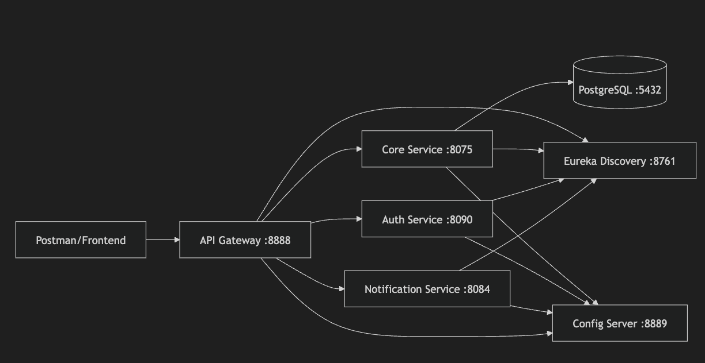

# Microservice

A modular microservices ecosystem built with **Spring Boot 3.2.5** and **Spring Cloud 2023.0.1**. This platform demonstrates a modern distributed architecture with centralized configuration, service discovery, and resilient API routing.

---

## System Architecture

The system is composed of several microservices:

- **Gateway Service (Port 8888)**: Single entry point, handling routing and resiliency.
- **Discovery Service (Port 8761)**: Eureka Service Registry for dynamic service discovery.
- **Config Server (Port 8889)**: Centralized configuration management using Spring Cloud Config.
- **Core Service (Port 8075)**: Manages Products, Warehouses, and Inventory details.
- **Auth Service (Port 8090)**: Handles authentication and service health monitoring.
- **Notification Service (Port 8084)**: Asynchronous email delivery system.
- **Shared Module**: Common library for exceptions, DTOs, and utility classes.
  
---

## Quick Start

### 1. Prerequisites
- [Docker Desktop](https://www.docker.com/products/docker-desktop/) installed.
- [Maven](https://maven.apache.org/) (for building JARs manually).

### 2. Configure Environment
Create a `.env` file in the root directory:
```env
# Database
DB_USERNAME=your_db_username
DB_PASSWORD=your_secure_db_password
DB_NAME=ecommerce

# Email (Gmail App Password required)
MAIL_USERNAME=your-email@gmail.com
MAIL_PASSWORD=your-gmail-app-password
```

### 3. Run with Docker
```bash
# Build the project
mvn clean package -DskipTests

# Start all services
docker compose up --build
```

---

## Documentation

For detailed information on how to interact with the services, please refer the documentation:

#### [API Testing Guide (docs/API.md)](docs/API.md)
The comprehensive guide to all REST endpoints, including:
- **Core Service**: Product and Warehouse management.
- **Notification Service**: How to send emails.
- **Auth Service**: Health checks and connectivity.
- **Testing Workflow**: The recommended order for testing the full system.
- **Troubleshooting**: Solutions for common errors (404, 503, etc.).

---

### Management Interfaces

| Interface | URL |
|-----------|-----|
| **Eureka Dashboard** | [http://localhost:8761](http://localhost:8761) |
| **Config Server** | [http://localhost:8889/core/default](http://localhost:8889/core/default) |
| **API Gateway** | [http://localhost:8888](http://localhost:8888) |

---

### Common Commands

- **Stop all services**: `docker compose down`
- **Restart a service**: `docker restart <service-name>` (e.g., `docker restart notification`)
- **View logs**: `docker logs <service-name> --tail 50`
- **Build JARs only**: `mvn clean package -DskipTests`

