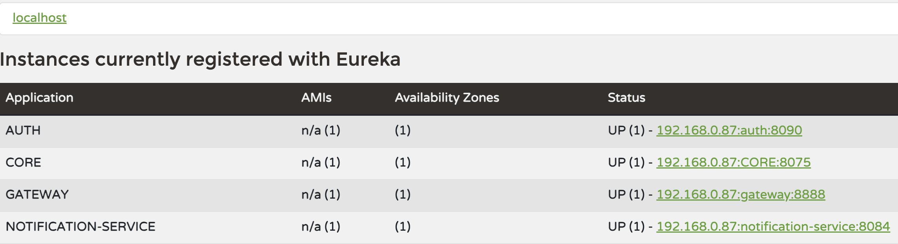

# microservice
This project is a Spring Boot–based microservices system built using a modular architecture. 

---

## Services Overview

### 1. Core Service
This service handles the core business functionality.

**Responsibilities**
- Product management
- Product details management
- Warehouse management
- JPA entities, repositories, services, controllers
- Uses DTOs and mappers
- Uses shared exception handling

**Key Endpoints**
- `/product`
- `/product-details`
- `/warehouse`

---

### 2. Shared Service
This service contains reusable code shared across all microservices.

**Includes**
- Global exception handler
- Custom exceptions (e.g. `ResourceNotFoundException`)

This module is added as a dependency in other services.

---

### 3. Auth Service
This service is responsible for authentication and authorization.

**Responsibilities**
- Login / registration

---

### 4. Gateway Service
This service acts as the single entry point for all client requests.

**Responsibilities**
- Request routing  
The gateway routes incoming requests to the appropriate service using Eureka service discovery and applies basic resiliency patterns.
Requests starting with `/core/**` are routed to the CORE service.
Requests starting with `/auth/**` are routed to the AUTH service.
The gateway removes the service prefix (/core or /auth) before forwarding the request.
A circuit breaker is configured for each route to handle service failures gracefully. If the target service becomes unavailable, requests are redirected to a fallback endpoint.
This prevents cascading failures and keeps the system responsive.

---

### 5. Discovery Service
This is a service registry that uses Eureka.

**Responsibilities**
- Registers all services
- Enables service-to-service communication without hardcoding URLs  
  The following image shows all services registered with the Eureka Discovery Server.


---

## Running the Project

### Prerequisites
- Java 17+
- Maven
- Database (MySQL/PostgreSQL)
### Build All Services
```bash
mvn clean install
```
### Run Services (recommended order)
- discovery
- gateway
- shared
- auth
- core  
Example :
  ```   
  bash cd discovery
  mvn spring-boot:run
  ```
